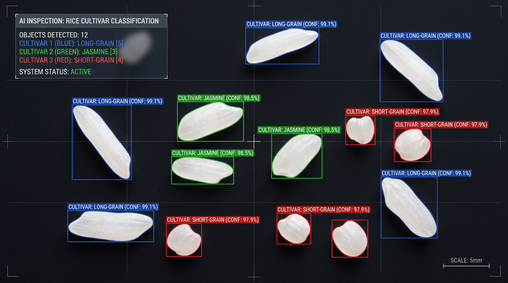
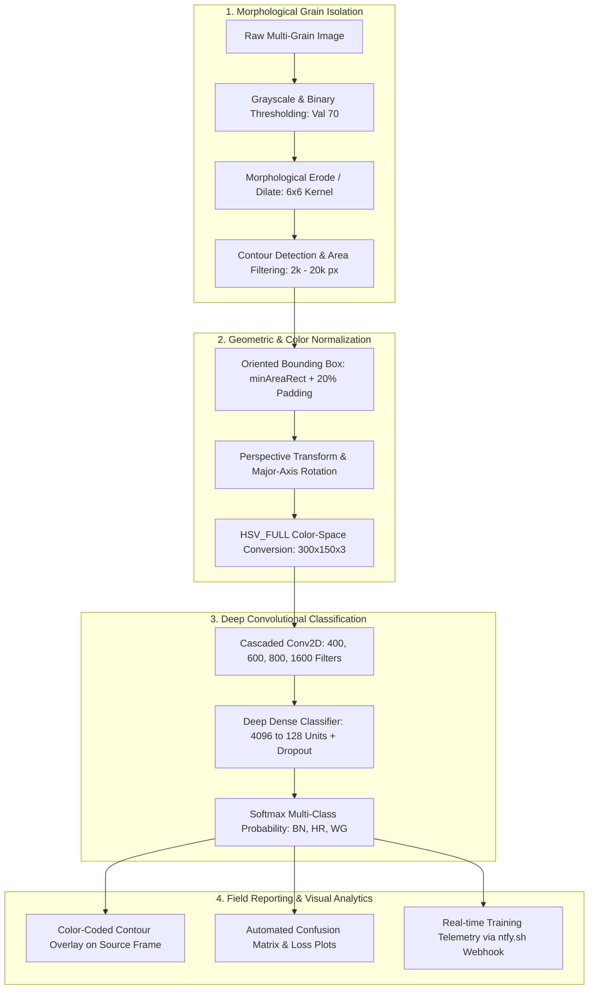

# Rice Cultivar Classification with OpenCV & CNN

An automated Computer Vision and Deep Learning framework engineered for non-destructive agricultural grain quality inspection and phenotypic analysis. The system detects, segments, and normalizes individual rice grains distributed across an inspection surface and classifies distinct cultivars (`BN`, `HR`, `WG`) with color-coded visual bounding overlays.

## 📌 Demonstration & Visual Output

<div align="center">
  
  <p><em>Figure: Automated segmentation, perspective rectification, and color-coded multi-class contour overlay distinguishing rice cultivars on an inspection surface.</em></p>
</div>

## ⚙️ Architectural & Pipeline Design



## 🔬 Core Technical Highlights

### 1. Invariant Morphological Segmentation & Spatial Normalization

* **Noise Rejection**: Applies calibrated binary thresholding ($\text{threshold}=70$) followed by dual-pass erosion and dilation using a $6 \times 6$ structural element to sever touching grain boundaries and suppress surface dust.

* **Size-Constrained Area Filtering**: Restricts extraction to contours within $2,000 \le \text{Area} \le 20,000$ pixels, filtering out unhulled debris and clustered aggregates.

* **Perspective Rectification**: Computes minimum bounding rectangles (`cv2.minAreaRect`), applies dynamic 20% padding expansion, and rectifies perspective distortion via Homography matrices (`cv2.getPerspectiveTransform`). All segmented grains are standardized to a vertical orientation through automated 90°/180° rotations.

### 2. Chromatic Representation (HSV Color Space)

* Segmented grains are projected into the **HSV_FULL** color spectrum prior to neural feature extraction.

* Isolates chromatic characteristics (pigmentation, translucency, and chalkiness) from luminance shifts and ambient shadows cast under industrial top-down lighting.

### 3. High-Capacity Deep CNN Architecture

* **Backbone Feature Extractor**: 4-stage convolutional hierarchy scaling from 400 to 1,600 filters with $4 \times 4$ kernel sizes and `BatchNormalization` layers.

* **High-Dimensional Latent Projections**: Multi-layer Dense head structured across 4096, 2048, 1024, 512, 256, and 128 units, regulated by staged Dropout (0.5 to 0.2) to prevent feature co-adaptation.

* **Convergence Strategy**: Adam optimizer parameterized with an ultra-fine learning rate ($\eta = 10^{-7}$) and early stopping mechanisms (`patience = 300`, restoring optimal validation loss checkpoints).

### 4. MLOps Observability & Automated Reporting

* Integrates automated evaluation hooks saving high-resolution Confusion Matrices and training Loss curves.

* Dispatches real-time training telemetry payloads (accuracy, total parameters, elapsed execution time) to remote operations endpoints using Webhook APIs (`ntfy.sh`).

## 📂 Repository Layout

```
rice-cultivar-vision-classifier/
├── README.md
├── requirements.txt
├── .gitignore
├── docs/
│   └── demo_sample.jpg            # Visual classification sample
└── src/
    ├── inference_pipeline.py      # Grain segmentation, perspective alignment & visual overlay
    └── train_cnn.py               # Deep CNN architecture, training loops & evaluation


```

## Target classes

The training label order is `['BN', 'HR', 'WG']`. The inference code assigns OpenCV BGR colors as follows:

| Class | Index | Overlay |
| --- | --- | --- |
| BN | 0 | Red |
| HR | 1 | Blue |
| WG | 2 | Green |

## Setup and execution

The training dataset and `.keras` model are not bundled. A desktop Python environment with Tkinter is needed for file-selection dialogs. TensorFlow/Keras dependencies specify lower bounds rather than a validated environment lock.

### Install dependencies

Run these commands from a terminal with Python available:

```bash
git clone https://github.com/Panutle/rice-cultivar-vision-classifier.git
cd rice-cultivar-vision-classifier
python -m venv .venv
```

Activate the environment using the command for your shell:

| Shell | Command |
| --- | --- |
| Windows PowerShell | `.\.venv\Scripts\Activate.ps1` |
| macOS / Linux | `source .venv/bin/activate` |

```bash
python -m pip install -r requirements.txt
```

### Prepare data and output paths

- Training expects a flat folder of grain images named with a class prefix, such as `BN_001.jpg`, `HR_001.jpg`, and `WG_001.jpg`. Labels are read from the text before the first underscore.
- Update the hard-coded `/Users/...` output paths in the `Variable` classes in both scripts and create those directories. The training folder is selected by a GUI dialog; output paths are not selected automatically.
- The training loader writes and removes temporary `HSV_` images in the input folder, so use a writable working copy.
- Replace or disable the `ntfy.sh` notification call in the training script for your environment.

### Train

```bash
python src/train_cnn.py
```

Select the training image directory. The script saves a model, confusion matrix, and loss plot to the configured locations.

### Classify an inspection image

```bash
python src/inference_pipeline.py
```

Select a `.jpg` or `.png` inspection image and then a compatible `.keras` model. The script segments grains and saves an annotated image to the configured output path.

## Limitations

Thresholds and contour-area filters are tuned to the original image scale and capture conditions. Validate them on new lighting, backgrounds, and camera resolutions. The repository does not include an independent test set or a reproducible accuracy benchmark. Training augments images before splitting, so a source-image-level split would be needed to avoid related augmentations crossing evaluation boundaries.
